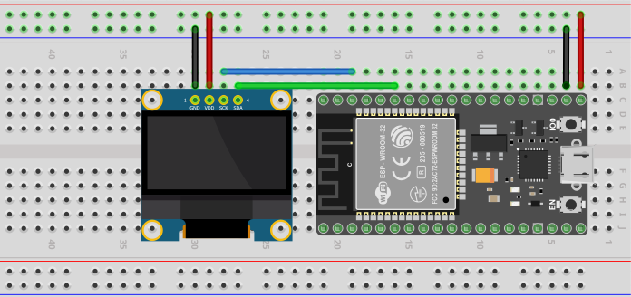

# Bitcoin Ticker
Bitcoin Ticker is Arduino code for ESP32 boards. This ticker displays the price of Bitcoin/USD and idicates whether the crypto currency went up or down. The price data comes from the CoinMarketCap API.

(FYI - there are affliliate links here to hardware you might need.)

# Hardware
* <a target="_blank" href="https://www.amazon.com/gp/product/B08FD643VZ/ref=as_li_tl?ie=UTF8&camp=1789&creative=9325&creativeASIN=B08FD643VZ&linkCode=as2&tag=sonbrooks-20&linkId=9faac9c05979ab5d1800f8007b87bc86">0.96 Inch OLED Module 12864 128x64 Yellow Blue SSD1306 Driver I2C IIC Serial Self-Luminous Display Board</a>
* <a target="_blank" href="https://www.amazon.com/gp/product/B07Q576VWZ/ref=as_li_tl?ie=UTF8&camp=1789&creative=9325&creativeASIN=B07Q576VWZ&linkCode=as2&tag=sonbrooks-20&linkId=3a96c90ac45fbedce46412bc24f99fe7">MELIFE ESP32 ESP-32S Development Board</a>

# Wiring Diagram

# Installation
Connect your ESP32 board to your computer and open `bitcoinTicker.ino` with the Arduino IDE. 

Hit the `Verify` button. Install any necessary libraries via `Tools > Manage Libraries`. Below is the list of libraries I used in this project. You should be able to find them pretty quick by typing these into the search bar. All libraries are found in the Arduino Library Manger(`Tools > Manage Libraries`.) No special installation is needed outside of their library.

Libraries Used:
* Adafruit_SSD1306 (For the OLED Display)
* WiFi (For ESP32 onboard WiFi)
* Wire
* HTTPClient (To make requests to CoinMarketCap)
* NTPClinet (Used to get the time for "Last Updated")
* WiFiUdp (Used to get the time for "Last Updated")
* ArduinoJson (Used to process JSON data retreived from CoinMarketCap)

Once everything is verified successfully, hit the `Upload` button. If your OLED is wired up correctly, you should see the screen displaying that it's connecting to your network, then it will show the ticker. 

I am using the <a target="_blank" href="https://www.amazon.com/gp/product/B07Q576VWZ/ref=as_li_tl?ie=UTF8&camp=1789&creative=9325&creativeASIN=B07Q576VWZ&linkCode=as2&tag=sonbrooks-20&linkId=3a96c90ac45fbedce46412bc24f99fe7">MELIFE ESP32 ESP-32S Development Board</a> from Amazon. They're usually priced around $15 for two boards.

# Usage
Plug Micro-USB into the Arduino and everything should boot up successfully in less than 10 seconds.

# Support You
Whatever you need; questions answered, requests, bugs; make an Issue. I'll get to them as soon as I can.

# Support Me
Support me with some Bitcoin! - Wallet: 1NjSoJX4biGi5hW72NX7eLYvzMVgjChfRA

Otherwise click on my affiliate links!

