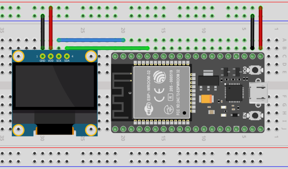

# Bitcoin Ticker
***NOT FOR COMMERCIAL USE***
Please reach out to me if you'd like to use it commercially. I am willing to come to an agreement. 

Bitcoin Ticker is Arduino code for ESP32 boards. This ticker displays the price of Bitcoin/USD and idicates whether the crypto currency went up or down. The price data comes from the CoinMarketCap API.

# Hardware
* <a target="_blank" href="https://amzn.to/4cAlNrS">0.96 Inch OLED I2C IIC Display Module</a>
* <a target="_blank" href="https://amzn.to/4lBQdht">ESP32 Development Board</a>

# Wiring Diagram

# Installation
Connect your ESP32 board to your computer and open `bitcoinTicker.ino` with the Arduino IDE. 

In `Tools > Board` select `DOIT ESP32 DEVKIT V1`.

Select the correct port that your ESP32 is plugged into via `Tools > Port`. If your board isn't showing up, you might need to install some drivers. A Google Search for `ESP32 Drivers` should give you what you need.

Hit the `Verify` button. Install any necessary libraries via `Tools > Manage Libraries`. Below is the list of libraries I used in this project. You should be able to find them pretty quick by typing these into the search bar. All libraries are found in the Arduino Library Manger(`Tools > Manage Libraries`.) No special installation is needed outside of their library.

Libraries Used:
* Adafruit_SSD1306 (For the OLED Display)
* WiFi (For ESP32 onboard WiFi)
* Wire
* HTTPClient (To make requests to CoinMarketCap)
* NTPClinet (Used to get the time for "Last Updated")
* WiFiUdp (Used to get the time for "Last Updated")
* ArduinoJson (Used to process JSON data retreived from CoinMarketCap)

Once everything is verified successfully, hit the `Upload` button. If your OLED is wired up correctly, you should see the screen displaying that it's connecting to your network, then it will show the ticker. 

I am using this <a target="_blank" href="https://amzn.to/4cAlNrS"> ESP32 Development Board</a> from Amazon. 

# Usage
Plug Micro-USB into the Arduino and everything should boot up successfully in less than 10 seconds.

# Support You
Whatever you need; questions answered, requests, bugs; make an Issue. I'll get to them as soon as I can.

# Support Me
Support me with some crypto on Coinbase! - @SonBrooks

Or buy me a coffee - https://www.buymeacoffee.com/SonBrooks

(Using my links may help me earn commission)
